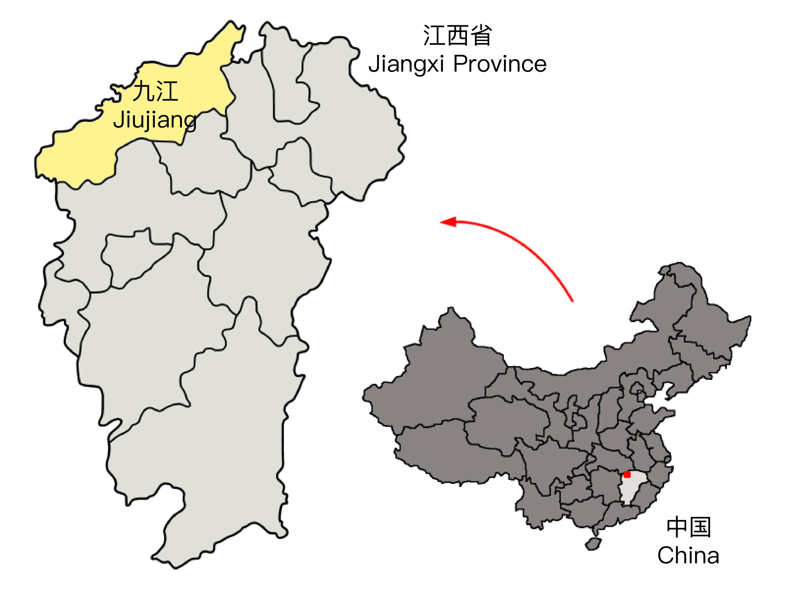
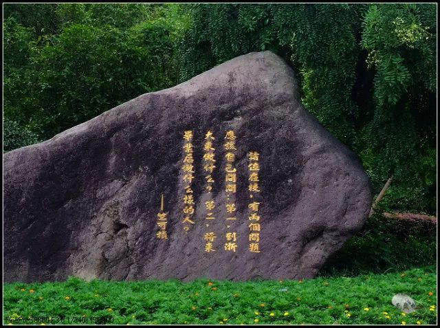

My name is Shimin Shuai (帅世民). I was asked many times about what's the meaning of my name in Chinese.
My family name (Shuai/帅) simply means *handsome* in Chinese; my first name is identical to a famous Chinese ruler in history, the [Emperor Taizong of Tang](https://en.wikipedia.org/wiki/Emperor_Taizong_of_Tang).
This is actually a sheer coincidence because the new born registration officer misspelled my name from *Shi-ming* to *Shi-min* -- a well-known behavior with southern Mandarin accent.
It turns out that there may be another coincidence, debatably, Taizong and I also share the same birthday (January 23)!

### My History
#### Seventeen years in Jiujiang
I was born in Jiujiang, a mid-sized city in southern China. In case you are wondering where it is, check the red dot in the map below (source: Wikipedia).

My childhood was both typical and atypical among my generations.  The typical part is that I spent most of my time in urban areas, without many opportunities to explore the nature, which I like a lot now.  The atypical part is that unlike many of my peers who were pushed by their parents to attend extracurricular courses, I had the option to spend my time doing what I want to, such as reading (mostly censored versions of fictions for children and teenagers) and playing computer games (I’m still an active gamer!). In middle school, I even settled up a small chemistry lab at home. Although I can't remember what experiments I did and I have also decided to avoid any beakers and test tubes later in college, this early experience made science not an enemy, but a friend.

#### Four years in Hangzhou
When I was 17, I graduated from high school and moved to Hangzhou for college. As a so called *paradise* city in China, Hangzhou is full of scenic rivers, parks and trails. I don’t think one can ever forget the beauty of the gorgeous Western Lake.

My time in Zhejiang University (ZJU) is arguably the first turning point in my life. There are two famous questions ask by Zhu Kezhen, who was the president of ZJU during the World War II: *What do you want to do at ZJU? Who do you want to be after graduation?* You can even find these two questions at the main entrance of the Zijin'gang Campus of ZJU today (in the photo below).

Indeed, it is ZJU where I found my personal passions. 

#### Five years in Toronto
After college, I moved to Toronto for PhD studies.

#### ? years in Heidelberg
After PhD, I moved again to a third country -- Germany -- for my postdoc.